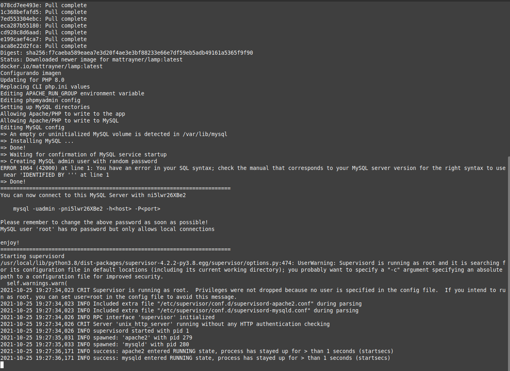

# AutoDoc

Scripts que automatiza la creación de contenedores Docker, para la implementación de redes de sensores en el LIA 

## Comenzando

Estas instrucciones te permitirán obtener una copia del proyecto en funcionamiento en tu máquina local para propósitos de desarrollo y pruebas.

### Pre-requisitos

* Distribución GNU/Linux basada en Debian (Linux Mint, Ubuntu, entre otros)
* Acceso a internet
* Conocimientos básicos de uso de Terminal

### Recomendaciones
* Usar la terminal en pantalla completa para visualizar de mejor manera el contenido

### Modo de uso para la web 🔧

Si descargamos el script de la web, solo debemos descomprimir el zip y mover la carpeta generada al directorio HOME de nuestro usuario y seguir los siguientes pasos:

Abrimos una terminal y nos ubicamos en dicho directorio:

```
cd AutoDoc
```

Ejecutamos el script que instalara los paquetes necesarios y configura la imagen con los aditamentos necesarios:

```
sudo ./Docker.sh
```
Una vez nos que salga algo como lo siguiente:



Abrimos otra terminal, nos dirigimos como en el paso anterior al directorio **AutoDoc** y ejecutamos el script encargado de configurar la base de datos (sustituimos el "2" por el número de variables que necesitemos, **por el momento solo se puede de 2 a 4 variables**):

```
sudo ./script2
```
Este script nos pedirá la información necesaria para la configuración de nuestra base de datos.

### Modo de uso para el repositorio 🔧

Para hacer uso de los scripts primero abrimos una terminal y clonamos el repositorio:

```
git clone https://github.com/Ricardo-Gomez-4-113/AutoDoc.git
```
Una vez clonado el repositorio, nos desplazamos al directorio de trabajo

```
cd AutoDoc
```
Dentro del directorio ejecutamos el script que instalara los paquetes necesarios y configura la imagen con los aditamentos requeridos:

```
sudo ./Docker.sh
```
Una vez nos que salga algo como lo siguiente:


Abrimos otra terminal, nos dirigimos como en el paso anterior al directorio **AutoDoc** y ejecutamos el script encargado de configurar la base de datos (sustituimos el "2" por el número de variables que necesitemos, **por el momento solo se puede de 2 a 4 variables**):


```
sudo ./script2
```
Este script nos pedirá la información necesaria para la configuración de nuestra base de datos.

### Aclaraciones 

Es necesario saber que dentro del directorio Autodoc:

* Los archivos deberán ser puestos en el directorio **app** para que el servidor web los tome en cuenta
* Los archivos de configuración de la base de datos se encuentran en el directorio **mysql**


Una vez los script sean ejecutados la primera vez, ya no sera necesario ejecutarlo cada vez que se requiera utilizar el contenedor, para volver a usar el mismo contenedor usamos el siguiente comando:


```
sudo docker start autodoc
```
Esperamos un momento y ya tendremos nuevamente nuestro contenedor corriendo.

## Construido con

* [Docker](https://docs.docker.com/get-started/overview/) - Tecnologia de virtualizacion utilizada
* [Bash](https://tiswww.case.edu/php/chet/bash/bashtop.html) - Interfaz de usuario de línea de comandos
* [Imagen docker](https://hub.docker.com/r/mattrayner/lamp) - Imagen para el contenedor docker, la cual contiene los paquetes necesarios

## Autores

* **Ricardo Gomez** - *Creación del script* - [Ricardo-Gomez-4-113](https://github.com/Ricardo-Gomez-4-113)
* **Tristán Huerta** - *Sistema Web* - [trinat00](https://github.com/trinat00)

## Créditos

* **Ricardo Montoya** - *Conocimiento sobre los paquetes necesarios* - [RickyMontoya11](https://github.com/RickyMontoya11)


## Expresiones de Gratitud 🎁

Quiero agradecer a todas aquellas personas que contribuyeron indirectamente con el proyecto, a las personas que conforman al equipo de trabajo del Laboratorio de Iluminación Artificial, en especial: a la Doctora Nivia Iracemi Escalante Garcia por el apoyo moral, la constante revisión del protocolo y compartir su conocimiento, al profesor Eduardo Flores Gallegos por iniciarme en el mundo Linux y sus conocimientos técnicos, a las compañeras de séptimo semestre de TIC's, Jaqueline Garcia Luevano y Yatziri Amparo Esquivel Cruz por el apoyo moral, la resolución de dudas en algunos aspectos técnicos, la convivencia y sobre todo recordarme lo importante que son las cosas simples de la vida. ¡Es para mi un honor trabajar con todos ustedes!